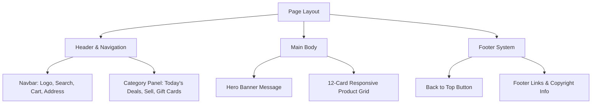

# 📦 Amazon Homepage Clone

A fully responsive, pixel-perfect clone of the Amazon homepage built from scratch using HTML5, CSS3, and Font Awesome. This project demonstrates modern responsive layouts, custom navigation controls, a multi-category product grid, and interactive hover mechanics mimicking a modern e-commerce platform.

---

## 🚀 Key Features

* **Authentic Navbar**: Classic dark header featuring the logo, address selector, custom search bar (dropdown select, input field, and magnifying glass button), language switcher, sign-in panel, and shopping cart.
* **Secondary Navigation Panel**: Responsive menu bar with the "All" categories trigger and quick links (Today's Deals, Customer Service, Registry, Sell).
* **Immersive Hero Banner**: A large hero image featuring dynamic localized welcoming messages.
* **Product Category Grid**: A responsive grid containing 12 distinct shopping cards (PCs, Toys, Shoes, Watches, Clothing, Home Decor, Mobile Launches, Gaming Accessories, and more).
* **Interactive Hover States**: Smooth border highlights, search-bar focus highlights, and click transitions designed to closely mirror the real Amazon experience.
* **Multi-Column Footer**: Modular footer panels featuring "Get to Know Us", "Make Money with Us", "Let Us Help You", and copyright policies.

---

## 🛠️ Built With

* **HTML5** - Structure and semantic page layout
* **CSS3** - Flexbox alignments, responsive grid, custom fonts, and styling
* **Font Awesome v6** - Vector icons for search, location, cart, and language settings

---

## 📂 Project Structure

```text
├── .gitignore             # Configured git ignore file
├── README.md              # Detailed documentation
├── amazon.html            # Main page markup file
├── style.css              # Custom styling sheet
└── [assets]               # Image dependencies (JPG, PNG, WEBP)
```

---

## 💻 How to Run Locally

You can preview the page locally with these simple steps:

1. Clone this repository to your local machine:
   ```bash
   git clone https://github.com/vinitgohil45/amazon-clone.git
   ```
2. Navigate into the directory:
   ```bash
   cd amazon-clone
   ```
3. Open `amazon.html` directly in your preferred web browser, or run it using a local server extension (e.g., Live Server in VS Code).

---

## 🎨 Layout Overview

